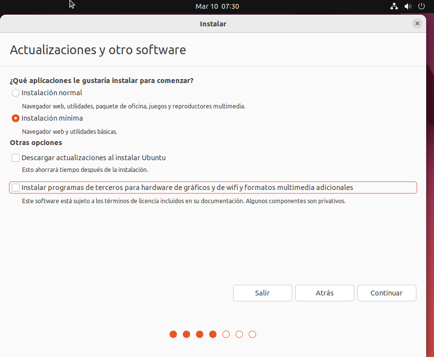

# Instalación de Ubuntu

## Que es Ubuntu?

Ubuntu es una distribución Linux basada en Debian GNU/Linux, que incluye principalmente software libre y de código abierto.

Puede utilizarse en ordenadores y servidores. Está orientado al usuario promedio, con un fuerte enfoque en la facilidad de uso y en mejorar la experiencia del usuario. Está compuesto de múltiple software normalmente distribuido bajo una licencia libre o de código abierto. Estadísticas web sugieren que la cuota de mercado de Ubuntu dentro de las distribuciones Linux es, aproximadamente, del 52 %, y con una tendencia a aumentar como servidor web. 

# Proceso de instalación

## Instalación de Virtualbox

Descargaremos [Virtualbox](https://www.virtualbox.org/) para el sistema operativo de nuestro ordenador.

## Configuración de Virtualbox

Arrancamos Virtualbox y hacemos click en "Nueva":


Escribimos el nombre de la máquina virtual, en nuestro caso "Ubuntu". Vemos que se selecciona automáticamente el tipo de sistema a "Linux" y la versión a "Ubuntu 64-bit".


Configuramos el tamaño de memoria para la máquina virtual. Para Ubuntu 22.04 se recomiendan 4GB (4096MB):


Creamos un nuevo disco duro virtual:


Elegimos del tipo de disco duro virtual de tipo VDI (Virtual Disk Image):


Le indicamos que el fichero del disco duro virtual crezca dinámicamente, a medida que necesitemos más espacio:


Configuramos el tamaño del disco duro virtual a 25GB, ya que es el tamaño recomendado en la instalación de Ubuntu 22.04:


Ya tenemos creada la máquina virtual, solo nos falta introducir el disco virtual del sistema operativo:


Nos descargamos previamente el archivo ISO de la distribución Linux que queramos. En nuestro caso hemos elegido la distribución [Ubuntu](https://ubuntu.com/), en su versión 22.04.

El siguiente paso es "montar" la ISO en el lector virtual de la máquina virtual. Para ello hacemos click en "Configurar y posteriormente vamos a la sección "Almacenamiento":


Hacemos click en "Vacío" dentro del árbol "Controlador IDE", y posteriormente elegimos el archivo ISO desde el icono de "Unidad Óptica":


Antes de arrancar configuramos la memoria de la tarjeta de vídeo al máximo posible, dentro de "Configuración" -> "Pantalla":


Por último la damos a "Iniciar" en la máquina virtual y vemos como empieza a arrancar:

## Instalación de Ubuntu

Vemos la pantalla de Grub y elegimos la opción "Try or Install Ubuntu", y le damos a la tecla "Enter":


Elegimos el idioma y hacemos click en "Instalar Ubuntu":


Elegimos la distribución de teclado:


Elegimos el tipo de instalación. En nuestro caso instalación mínima y le indicamos que instalaremos software de terceros:



Elegimos borrar todo el disco y que se instale Ubuntu como único sistema operativo:


# Actualización del sistema

## Actualización desde linea de comandos

Para actualizar el sistema desde linea de comandos abriríamos una terminal (Gnome-Terminal) y escribiríamos los siguientes comandos:

1. Actualizamos los índices de paquetes:

```
sudo apt update
```


2. Vemos la lista de paquetes que se pueden actualizar:

```
apt list --upgradable
```


3. Actualizamos los paquetes instalados que tienen nuevas versiones en los repositorios:

```
sudo apt upgrade
```


## Actualización desde el interfaz gráfico

Abrimos la aplicación "Software Updater".


Vemos como el "Software Update" comprueba las actualizaciones:


"Software Updater" nos informa de las actualizaciones y nos pregunta si queremos actualizar:


Por último se instalan las actualizaciones y debemos reiniciar el ordenador si nos lo pidiera:


# Instalación de software

Vamos a instalar la herramienta OBS Studio. Para ello seguiremos los pasos de la página web.

En primer lugar instalamos los paquetes que necesita OBS, en concreto el paquete ffmpeg:

```
sudo apt install ffmpeg
```


En segundo lugar nos dicen que añadamos el repositorio externo mediante la linea de comandos:

```
sudo add-apt-repository ppa:obsproject/obs-studio
```


En tercer lugar actualizamos los índices de todos los repositorios:

```
sudo apt update
```

Por último instalamos OBS Studio:

```
sudo apt install obs-studio
```


## Mediante la herramienta synaptic

En primer lugar debemos comprobar que tenemos la herramienta instalada, podemos usar la siguiente linea de comandos para instalarla:

```
sudo apt install synaptic
```


##


# Referencias

- "Ubuntu". Wikipedia. Disponible en: [https://es.wikipedia.org/wiki/Ubuntu](https://es.wikipedia.org/wiki/Ubuntu)  (Accedido: 6 de marzo, 2023).
